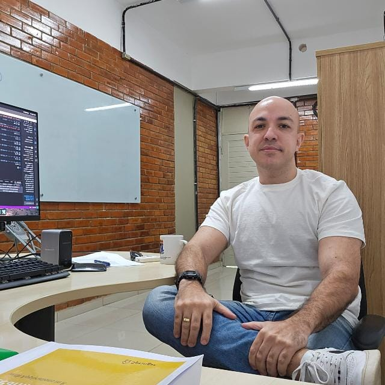
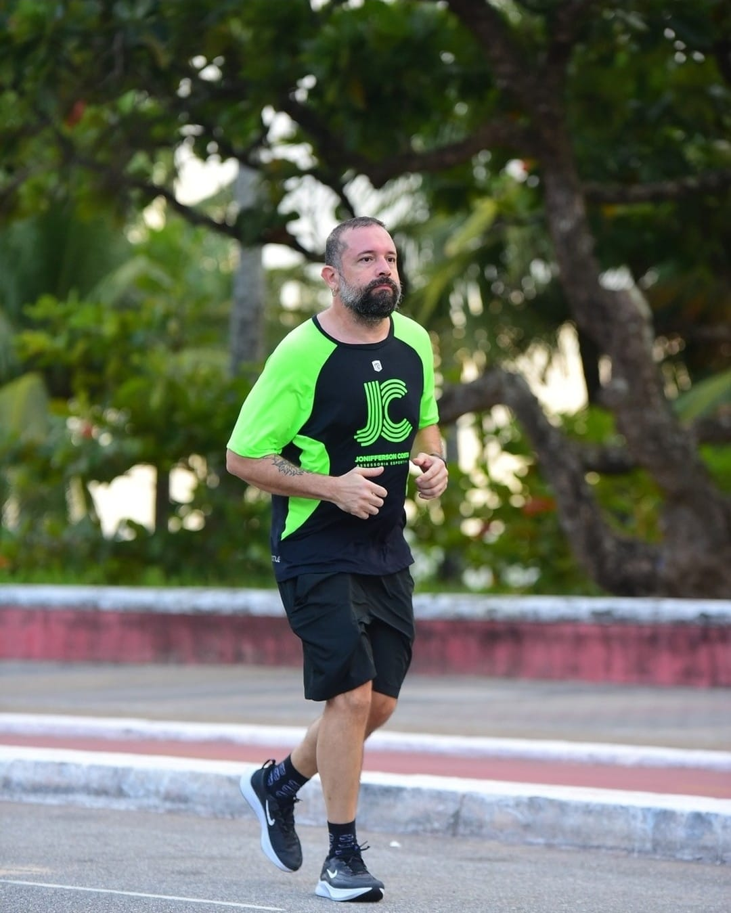

<h1> Orientadores</h1>

  

    <h2>Prof. Dr. Eufrásio de Andrade Lima Neto</h2>
    

      Graduação e mestrado em Estatística (UFPE) e doutorado em Ciências da computação (UFPE). É Professor Associado III do Departamento de Estatística da UFPB com participação no Programa de Pós-Graduação Matemática e Modelagem Computacional. Atua em: Modelagem Estatística, Aprendizagem de Máquina, Regressão Robusta, Modelos Lineares Generalizados, Análise de Dados Simbólicos, Regressão Clusterwise e Métodos baseado em Kernel.
    

  

  

  

    <h2>Prof. Dr. Pedro Rafael Diniz Marinho</h2>
    

      Graduação em Estatística (UFPB) e mestrado e doutorado em Estatística (UFPE). Foi bolsista da Fundação de Amparo a Ciência e Tecnologia do Estado de Pernambuco. É professor Adjunto do Departamento de Estatística da UFPB com participação no Programa de Pós-graduação em Modelagem Matemática e Computacional. Atua em: Ciência de Dados, Métodos Estatísticos Computacionalmente Intensivos, Construção de Softwares pa ra a Estatística, Inferência Estatística Clássica e Probabilidade.
    

  

    

  

    <h2>Prof. Dr. Marcelo Rodrigo Portela Ferreira</h2>
    

      Graduação e mestrado em Estatística (UFPE), douturado em Ciência da Computação (UFPB) e pós-douturado na RWTH Aachen University, Alemanha. É professor Associado I do Departamento de statística da UFPB com participação no Programa de Pós-Graduação em Modelos de Decisão e Saúde. Atua em: Aprendizado de Máquina, Ciência de Dados e Estatística Computacional, Métodos não-paramétricos e análise de dados simbólicos.
    

  

    

  

    <h2>Prof. Dr. Luiz Medeiros de Araujo Lima Filho</h2>
    

      Graduação em Estatística (UFPE), mestrado e doutorado em Biometria e Estatística Aplicada (UFRPE), pós-doutorado com o professor pesquisador Fábio Mariano Bayer (UFSM). É Professor Associado I do Departamento de Estatística da UFPB com participação no Programa de Pós-Graduação em Modelos de Decisão e Saúde. Atua em: controle estatístico de processos e modelagem.
    

  

    

<h1 class="members-heading">Membros</h1>
    

    

        
        
Paulo Ricardo S. Campana

        
Graduando no curso de estatística - UFPB com preferência pela área de modelagem estatística e simulação. Programador em R, C e Zig.

    

    

        
        
Gabriel de Jesus Pereira

        
Graduando no curso de estatística - UFPB com preferência pela área de modelagem estatística e probabilidade. Programador em R, Python e Elixir.

    

    

        
        
Rafhael Aurélio da Silva

        
Graduando no curso de estatística - UFPB com preferência pela área "modelagem alguma coisa ou algum interesse além da estatística". Programador em R.

    

