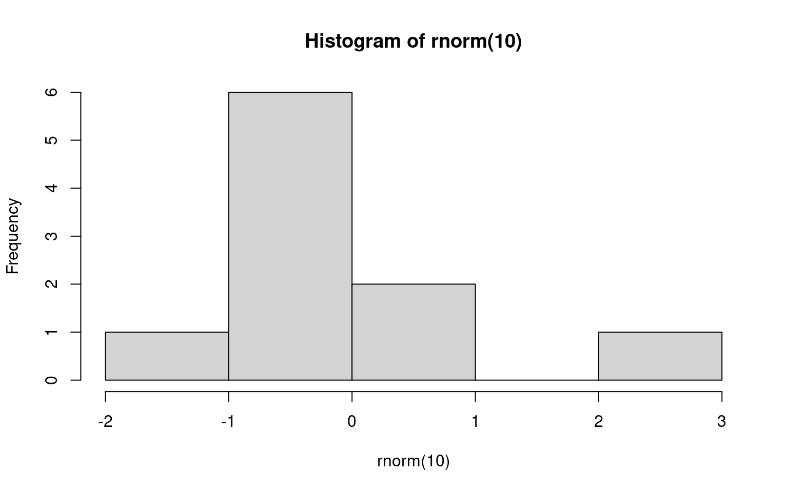

## Polar Axis

For a demonstration of a line plot on a polar axis, see **?@fig-polar**.

<details>
<summary>Code</summary>

``` r
print(1 + 1) + 5
```

</details>

    [1] 2

    [1] 7



$$
 \varphi = 1+\frac{1} {1+\frac{1} {1+\frac{1} {1+\cdots} } }
$$

Um texto $x^2$ qualquer com uma eq. $\int_0^1$


