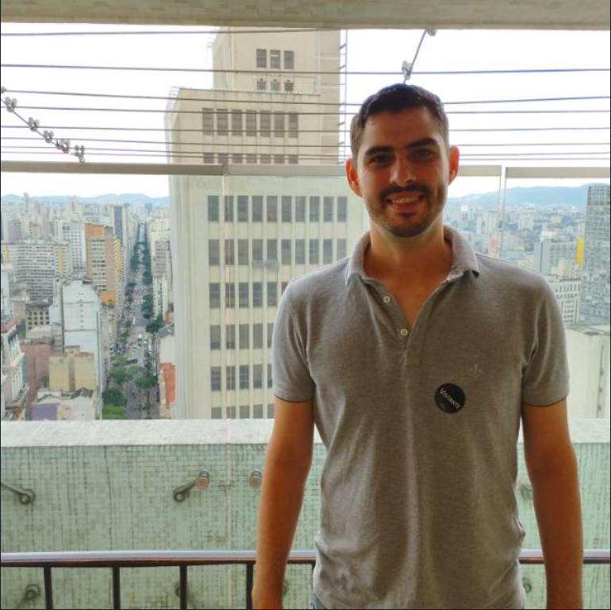

<table style="width:100%;">
<colgroup>
<col style="width: 33%" />
<col style="width: 33%" />
<col style="width: 33%" />
</colgroup>
<tbody>
<tr class="odd">
<td style="text-align: center;">

Graduando no curso de estatística da UFPB com preferência pela área de modelagem estatística e prob. . Programador em R, Python e Elixir.

</td>
<td style="text-align: center;">

Graduando no curso de estatística - UFPB com preferência pela área de modelagem estatística e simulação. Programador em R, C e Zig.

</td>
<td style="text-align: center;">

Graduando no curso de estatística da UFPB com preferência pela área “citar área”. Programador em R.

</td>
</tr>
</tbody>
</table>
